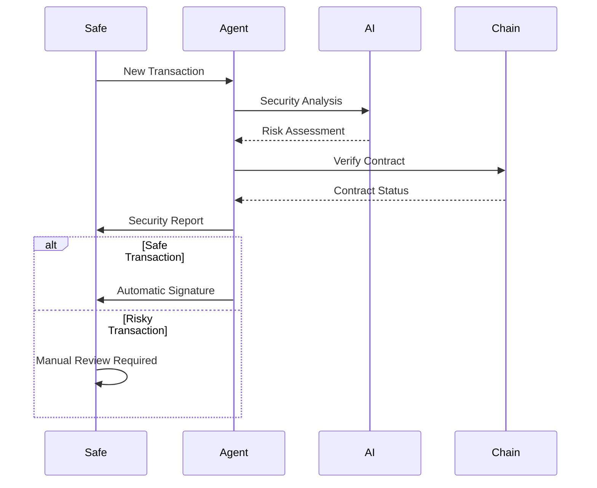

# Safe Duck Security Agent

"AI-Powered Security Guardian for Smart Account Transactions - Protecting Web3 Users from Scams and Malicious Activities" and automated transaction validation

## 🛡️ Smart Account Security Gaps

- Traditional transaction validation is often limited to basic checks
- Users are exposed to sophisticated scams and malicious contracts
- No comprehensive security analysis before transaction execution
- Limited protection against address poisoning and contract manipulation

## 🤖 Intelligent Security Solution

### 1. Multi-Layer Security Analysis

- Comprehensive transaction validation
- Contract interaction verification
- Address validation and poisoning detection
- Value transfer risk assessment
- Approval request analysis

### 2. Real-Time Threat Detection

✅ Address poisoning detection  
✅ Malicious contract patterns  
✅ Suspicious approval requests  
✅ High-risk value transfers  
✅ Known scam signatures  
🤖 Automatic confirmation for safe transactions

### 3. AI-Powered Risk Assessment

🧠 Market sentiment analysis  
🔍 Pattern recognition  
📊 Risk level classification  
💡 Actionable recommendations

## Quick Start

1. Install dependencies:

```bash
pnpm install
```

2. Copy `.env.example` to `.env` and fill in required values:

```bash
cp .env.example .env
```

Required environment variables:

- `AGENT_NAME`: Name for your security agent instance
- `P2P_NODE_PATH`: Path to P2P node executable
- `PRIVATE_KEY`: Private key for P2P network identity
- `OPENAI_API_KEY`: OpenAI API key for AI analysis
- `SIGNER_ADDRESS`: Address of the agent's signer
- `SAFE_ADDRESS`: Address of the Safe to monitor
- `HUMAN_SIGNER_1_ADDRESS`: Address of the human co-signer
- `RPC_URL`: Ethereum RPC URL

## 🎯 Key Benefits

### 1. Proactive Security

- Prevents attacks before they happen
- Real-time transaction validation
- Continuous threat monitoring

### 2. User Empowerment

**Manual Review Required:**  
❌ High-risk transactions  
❌ Unusual patterns  
❌ New contract interactions

**Automatic Confirmation:**  
✅ Known safe contracts  
✅ Verified addresses  
✅ Standard transactions  
✅ Low-risk operations

### 3. Enhanced Protection

The workflow:

1. User initiates transaction in Safe wallet
2. AI agent runs comprehensive security checks
3. Security report is generated
4. Transaction is automatically signed if deemed safe

## Development

Run locally:

```bash
pnpm run start
```

## API Endpoints

### Market Sentiment Analysis

```bash
POST /api/market-sentiment
```

Analyzes market conditions and sentiment for transaction timing.

### Transaction Security Analysis

```bash
POST /api/transaction-analysis
```

Performs comprehensive security checks on pending transactions.

## Architecture

### Security Analysis Flow



## Deployment

Deploy to Fly.io:

```bash
# Set required secrets
fly secrets set PRIVATE_KEY="your-private-key" \
               OPENAI_API_KEY="your-openai-api-key" \
               SIGNER_ADDRESS="your-signer-address" \
               SAFE_ADDRESS="your-safe-address"

# Deploy
pnpm run deploy:fly
```
